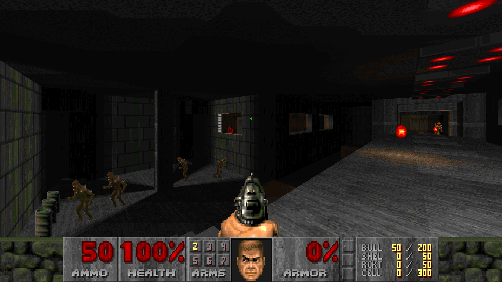
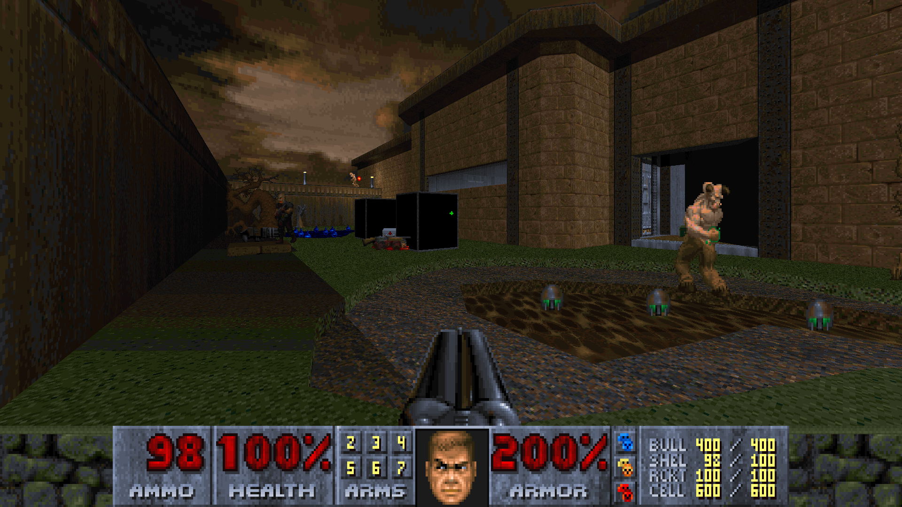
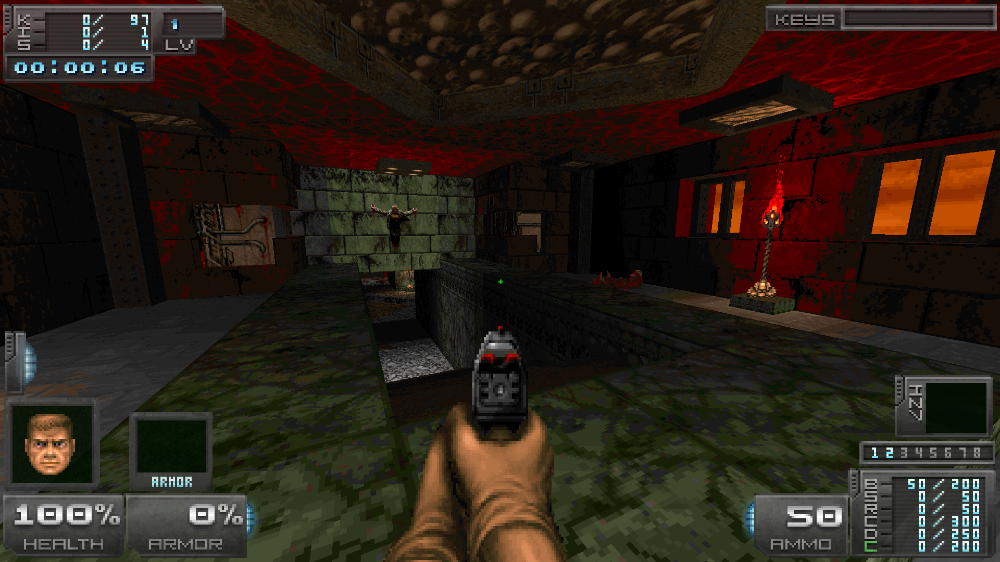
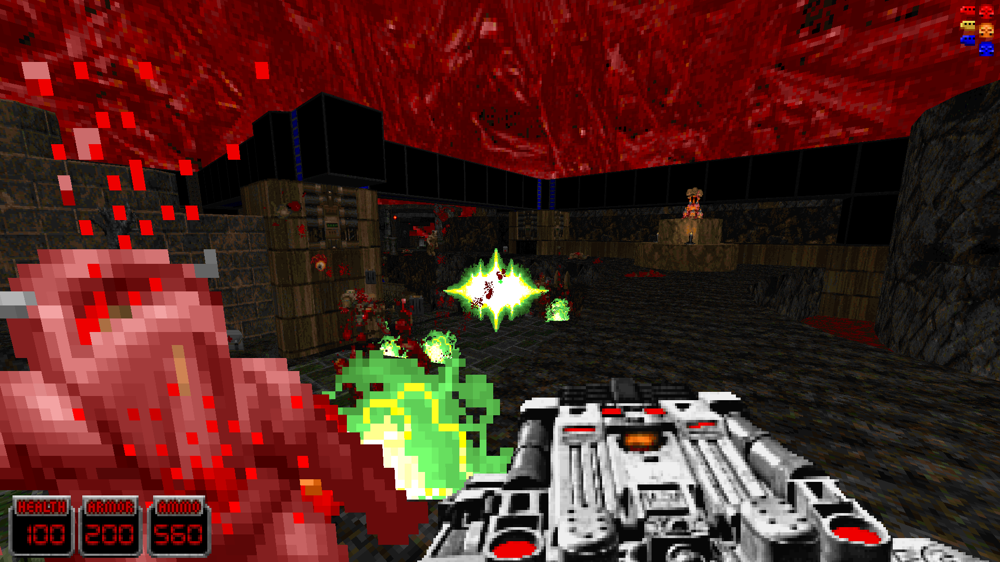

# GZDoom Classic [Correctly Preconfigured Build]

# STATUS: ✅RELEASED
GZDoom Classic - correctly preconfigured build by DRON12261

### ⚠️WARNING!⚠️ It's only a build, not a fork. The original GZDoom repository can be found [here]([https://forum.zdoom.org/viewtopic.php?t=58535](https://github.com/ZDoom/gzdoom)).

The build is based on GZDoom 4.11.3 and is correctly tuned in the sense that it is as close as possible in aesthetics to the original doom and other games. Moreover, it is correctly configured Hardware renderer.

Also the build is a portable version, ie not tied to any system folders, everything remains within the dirrectory itself GZDoom Classic, and that means it will not conflict with other builds.

The build is pre-configured for the following projects (the correct settings are automatically applied):
- Doom
- Freedoom
- Heretic
- Hexen
- Strife
- Chex Quest
- Harmony
- The Adventures of Square
- Action Doom 2
- HACX

### Download - [Latest Release - v4](https://github.com/dron12261games/SFT-GZDoom-Classic/releases/download/v4/GZDoom.Classic.v4.zipp)

# Hotkeys
The build includes several switch hotkeys to instantly re-configure the port for specific preferences, projects, and situations.

1) Demonstration mode: `Num/` - on, `Num*` - off
Demonstration mode includes invulnerability, flight, invisibility to monsters, noclip, as well as remove the entire interface. 
Very useful for making screenshots or recording videos.
Attention! Due to some technical limitations, there may be a situation where you could double-click, for example, to enable demonstration mode, and you have all the effects applied, but the interface will still be displayed. In this case, click again to enable demonstration mode and everything will be back to normal. It works the same way in the reverse direction.

2) Mouselook: `Num8` - on, `Num9` - off
When on, gives vertical mouse view and disables vertical auto-aim.
When off, disables vertical mouse view, returns vertical auto-aim, and automatically center the camera.

3) Classic renderer: `Num5` - on, `Num6` - off
Enables/disables binding of the renderer to the game palette
It is strongly recommended to leave it on for all near-vanilla projects (up to MBF21 and ZDoom), as it is a key point in authenticity and closeness of the picture to the original Doom.
It is recommended to disable only for special projects for GZDoom, which actively use colored dynamic lighting, colored fog or colored sector lighting.

4) Pixelization: `Num2` - on, `Num3` - off
Enables pixelization of the picture if you want to get some Crispy effect.

5) Dynamic Lighting: `Num+` - on, `Num-` - off
Enables/disables dynamic lighting of objects.
If you don't care about this feature, it is recommended to turn it off when playing with classic renderer.

6) Pistol-Start: `Num0` - on, `Num.` - off
Enables/disables pistol start for each map.
It is recommended to turn on for all near-vanilla projects, as the balance of maps is usually sharpened for this.
It is not recommended to enable it together with mods, because not all mods are designed for this and can simply break (some mods have their own special setting for pistol-start, if available, use it).

The following hotkeys are additionally implemented:
- `F` - Chaingun or other weapon on Slot 4
- `Alt` - Rocket launcher or other weapon on Slot 5
- `Q` - Plasmagun or other weapon on Slot 6
- `Z` - BFG or other weapon on Slot 7
- `MMB` - use the active item in the inventory
- `Side mouse buttons` - switch items in the inventory
- `X` - Fly/Swim up
- `C` - Fly/Swim Down

# Updating
When upgrading to a newer version of GZDoom, you just need to replace the files of the new build of GZDoom into the folder with GZDoom Classic. 
All settings, etc. will remain safe and intact.

# Extra
RLNDGM.sf2 soundfont is embedded into the build, which will give the original authentic sound of midi tracks, but in a slightly higher playing quality.

Additionally, the preconfigured automap coloring for Doom significantly increases its "readability" for colored doors, impassable lines, teleport triggers, etc.

The script for pistolstart was implemented by JP LeBreton. Page with original mod: https://jp.itch.io/doom-pistol-start

### Download - [Latest Release - v4](https://github.com/dron12261games/SFT-GZDoom-Classic/releases/download/v4/GZDoom.Classic.v4.zip)

# Screenshots:

